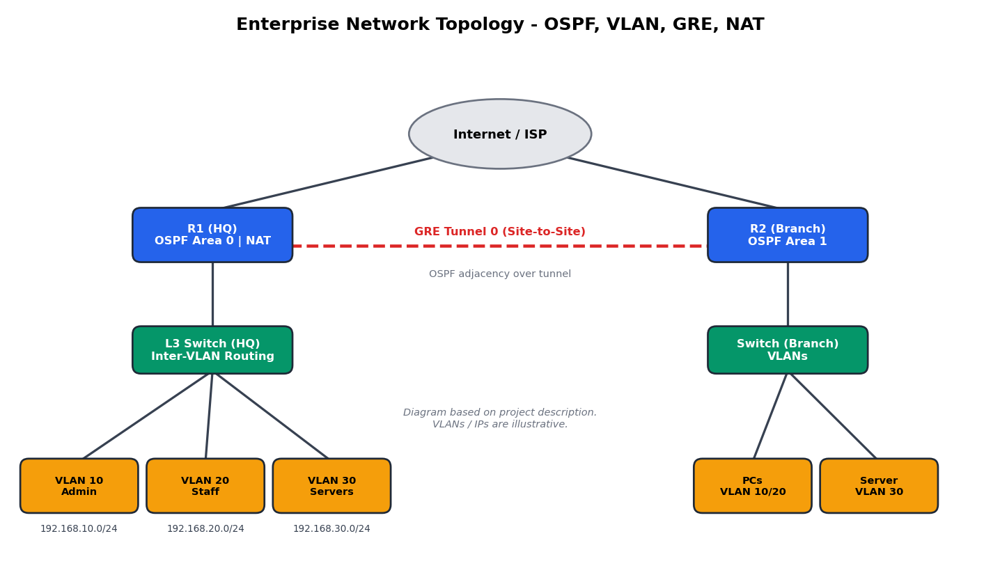

# Enterprise Network Topology Design & Implementation

A scalable enterprise network lab built in Cisco Packet Tracer, covering Layer 2/3 switching, dynamic routing and secure site-to-site connectivity.

## Overview
This project simulates a multi-site enterprise network with VLAN-based segmentation, OSPF routing across multiple areas, and GRE tunneling between distributed nodes.

## Features
- Multi-layer switching with custom VLAN segmentation
- Inter-VLAN routing
- OSPF as the core dynamic routing protocol (multi-area topology)
- Site-to-Site GRE tunneling
- Dynamic NAT for outbound access

## Tools
- Cisco Packet Tracer

## Topology

## Addressing Plan
| VLAN | Name | Subnet |
|------|------|--------|
| 10 | Admin | 192.168.10.0/24 |
| 20 | Staff | 192.168.20.0/24 |
| 30 | Servers | 192.168.30.0/24 |

(Replace with your actual VLANs and subnets.)

## Key Configurations
- `configs/` folder contains router and switch running-configs
- `enterprise-network.pkt` is the Packet Tracer file

## Verification
- `show ip ospf neighbor`
- `show ip route`
- `show vlan brief`
- `show interface tunnel 0`
- Ping tests between VLANs and across the GRE tunnel

## Author
Mehedi Hasan Meraz
[GitHub](https://github.com/mehedimeraz) | mehedimeraz012@gmail.com
